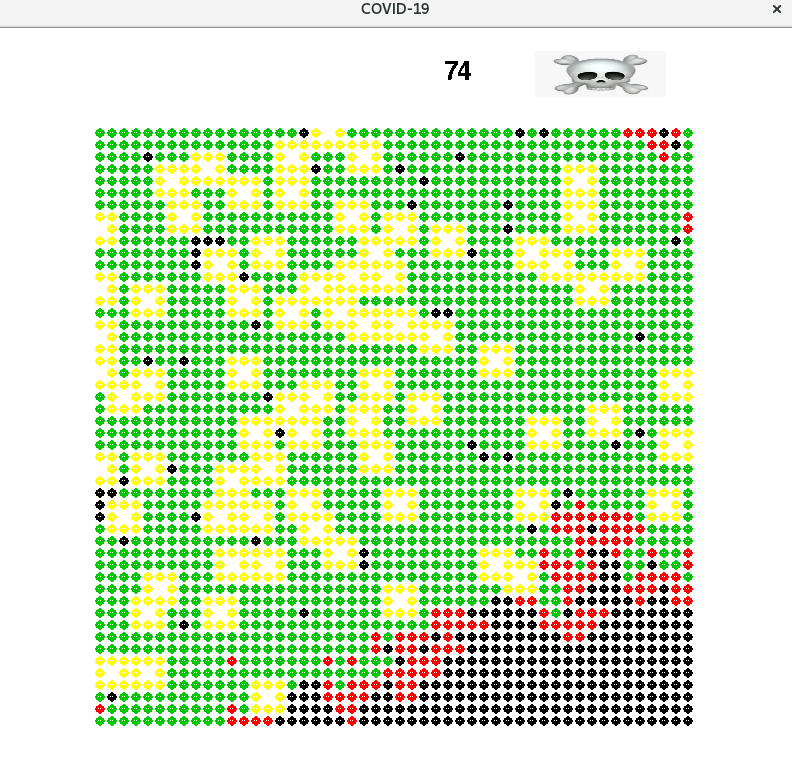

Basic epidemic simulation application (Covid 19)
================================

How To Use graphe_circulaire_et_personnalise (done by me) :
---------------
- `pip install -r requirements.txt`

- Modify constants such as `PROBA_DEATH`, `CONTAGION_RATE` and `VACCINATION_RATE`... (All variables are on the first part of code and could be played with)

- Run the simulation through:
`python graphe_circulaire_et_personnalise.py` for circular and personalised graph 

- The game will show up

- Press the Space bar to run the simulation

- Repress the Space bar to show statistics of the simulation

- Enjoy

- Exit the Program

#Notes
In app :

**black** is untouched by Covid
**Green** is immune
**White** is dead
**Red** is ill
**yellow** is confined

*The number in the top right (74) is the number of deaths in the simulation*

================================

How To use graphe_mixte (done by Souhail) and random_graph (done by Anas) :
---------------
- `pip install -r requirements.txt`

`python graphe_mixte.py` for mix graph 

`python random_graph.py` for random graph 
